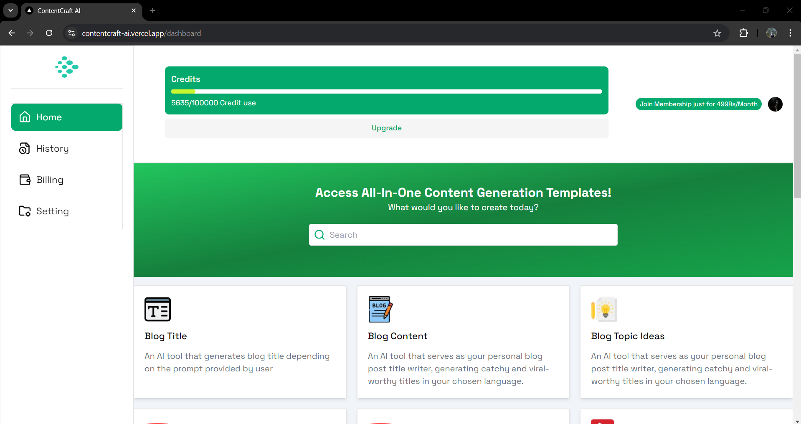

# ContentCraft-AI

**ContentCraft-AI** is an AI-powered SaaS application designed to enhance productivity by providing customizable templates for various services. Whether you're generating content, creating code, or optimizing SEO, ContentCraft-AI streamlines your workflow with over 15+ customizable templates. Our intuitive platform offers a seamless user experience and efficient solutions to meet diverse needs.

Checkout [app](app/README.md) for the installation process.

# Overview of whole system

## Home Screen.

  

 

## Clerk Authentication.

  

 

## Dashboard.

  

 

## Instagram post generated thorough AI.

  

 

## History of individual users.

  

 

## Billing page using Razorpay payment gateway integration.

  

 

## User profile

  

 

## Drizle Studio to store data of users

  

 
